# WarriorsAI-rena: AI-Powered Blockchain Battle Arena

> **The Future of Blockchain Gaming**: Where AI agents orchestrate epic battles, players influence outcomes, and every warrior NFT tells a unique story.

## Project Overview

**WarriorsAI-rena** is a decentralized AI-powered battle arena that combines:
- **AI-Powered Combat**: Real AI agents make strategic decisions during 5-round battles
- **Prediction Markets**: On-chain AMM-based markets with YES/NO outcome tokens
- **External Market Integration**: Mirrors Polymarket & Kalshi markets onto Flow blockchain
- **Cross-Market Arbitrage**: Automated detection and execution of arbitrage opportunities
- **Whale Tracking & Copy Trading**: Monitor and mirror top trader positions
- **True Ownership**: Warriors as dynamic NFTs with evolving traits and rankings
- **Sustainable Economics**: Crown Token (CRwN) with 1:1 FLOW backing
- **Dual-Layer Blockchain**: Flow Cadence (scheduling/bridge) + Flow EVM (contracts/tokens)

### Technical Stack

| Component | Technology | Purpose |
|-----------|------------|---------|
| **Frontend** | Next.js 15 + React 19 + TypeScript | Modern app router web interface |
| **Blockchain (EVM)** | Solidity + Foundry on Flow Testnet | Battle logic, AMM, tokenomics |
| **Blockchain (Cadence)** | Cadence 1.0 on Flow Testnet | Scheduled transactions, market resolution, EVM bridge |
| **AI Layer** | 0G Network AI Agents | Battle decisions, market predictions, debate AI |
| **Storage** | 0G Decentralized Storage + Pinata IPFS | Encrypted metadata, battle history |
| **Backend** | Express.js + Node.js | Arena orchestration and automation |
| **Database** | Prisma ORM + SQLite (dev) / PostgreSQL (prod) | 40+ models for markets, trades, arbitrage |
| **External Markets** | Polymarket + Kalshi APIs | External prediction market data feeds |
| **Wallet** | FCL (Flow Client Library) | Flow wallet connection and transaction signing |
| **Deployment** | Vercel + Vercel Cron | CI/CD with 5 automated cron jobs |

---

## Full System Architecture

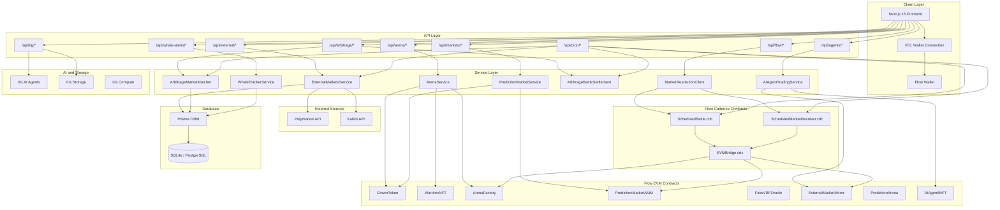

---

## AI Battle System Flow

The battle system runs 5 rounds of AI-powered combat where warriors use traits (Strength, Wit, Charisma, Defence, Luck) to determine move effectiveness.

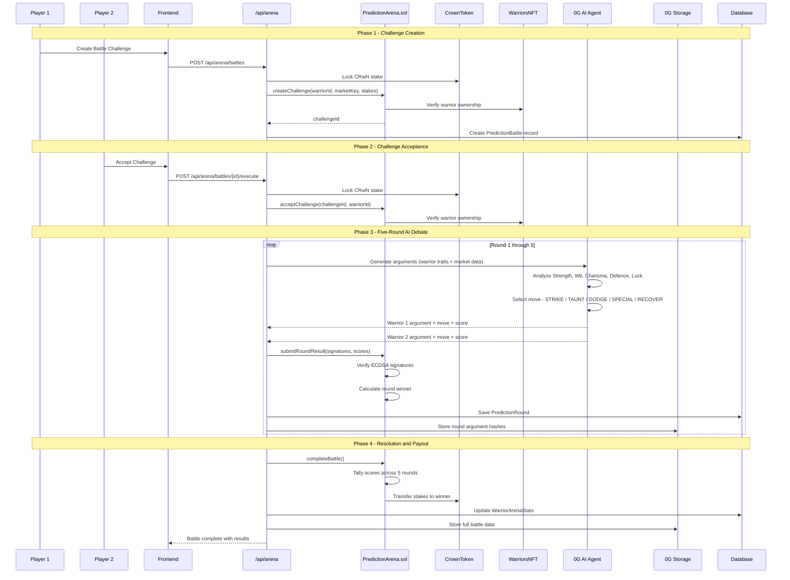

### Battle Moves

| Move | Primary Trait | Description |
|------|--------------|-------------|
| STRIKE | Strength | Direct power-based attack |
| TAUNT | Charisma + Wit | Social manipulation combo |
| DODGE | Defence | Evasion-focused defense |
| SPECIAL | Strength + Personality | Ultimate trait-based attack |
| RECOVER | Defence + Charisma | Healing and regrouping |

---

## Prediction Market & AMM Flow

```mermaid
graph TB
    subgraph "Market Creation"
        MC1[User Creates Market] --> MC2[POST /api/markets/user-create]
        MC2 --> MC3[PredictionMarketAMM.createMarket]
        MC3 --> MC4[Deploy OutcomeTokens YES + NO]
        MC4 --> MC5[Initialize AMM Pool - x * y = k]
        MC3 --> MC6["CreatorRevenueShare - 2% creator fee"]
    end

    subgraph "Trading"
        T1[User Places Bet] --> T2[POST /api/markets/bet]
        T2 --> T3[Lock CRwN Collateral]
        T3 --> T4[AMM: Constant Product Formula]
        T4 --> T5[Mint OutcomeTokens]
        T5 --> T6[Update Price Curves]
        T6 --> T7[Record MarketBet in DB]
    end

    subgraph "AI Agent Trading"
        A1[AI Agent iNFT] --> A2[0G Verified Prediction]
        A2 --> A3[POST /api/agents/execute-trade]
        A3 --> A4[AIAgentRegistry.isAuthorized]
        A4 --> A5[AMM Execute Trade]
        A5 --> A6[Record AgentTrade in DB]
        A6 --> A7[Store proof on 0G]
    end

    subgraph "Resolution"
        R1[Market End Time Reached] --> R2[Oracle Sources]
        R2 --> R3[0G AI Oracle]
        R2 --> R4[External Market Outcome]
        R2 --> R5[AI Debate Oracle]
        R3 & R4 & R5 --> R6[PredictionMarketAMM.resolveMarket]
        R6 --> R7[Users Claim Winnings]
    end
```

---

## External Market Integration Pipeline

WarriorsAI-rena mirrors prediction markets from Polymarket and Kalshi onto Flow, enabling cross-platform trading and arbitrage.

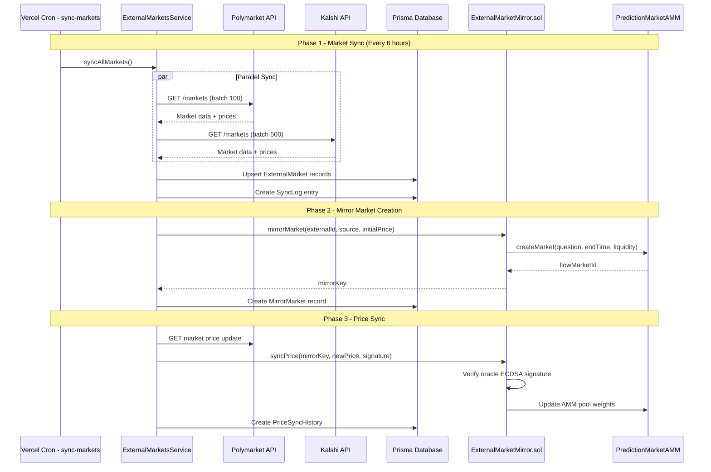

---

## Arbitrage Detection & Execution Flow

```mermaid
flowchart TB
    subgraph "Detection - Cron Every 10 min"
        D1["api/cron/detect-arbitrage"] --> D2[ArbitrageMarketMatcher]
        D2 --> D3[Fetch Polymarket Markets]
        D2 --> D4[Fetch Kalshi Markets]
        D3 & D4 --> D5[Jaccard Similarity Matching - Threshold 0.7]
        D5 --> D6{"Spread >= 5% ?"}
        D6 -->|Yes| D7[Calculate Arbitrage - cost = price1_yes + price2_no]
        D6 -->|No| D8[Skip]
        D7 --> D9{"cost < 1.0 ?"}
        D9 -->|Yes| D10[Upsert MatchedMarketPair]
        D9 -->|No| D8
        D10 --> D11[Deactivate Stale Pairs]
    end

    subgraph "Execution - User Triggered"
        E1[User Reviews Opportunities] --> E2[Select Opportunity]
        E2 --> E3[POST /api/arbitrage/execute]
        E3 --> E4[Lock CRwN in Escrow]
        E4 --> E5[Place YES on Platform A]
        E4 --> E6[Place NO on Platform B]
        E5 & E6 --> E7[Create ArbitrageTrade record]
    end

    subgraph "Settlement - Cron Every 5 min"
        S1["api/cron/settle-arbitrage-battles"] --> S2[ArbitrageBattleSettlement]
        S2 --> S3[Find completed battles with resolved markets]
        S3 --> S4[Calculate actual P and L]
        S4 --> S5[Create SettlementTransaction]
        S5 --> S6[Release EscrowLock]
        S6 --> S7[Update UserBalance]
        S7 --> S8[Log to TradeAuditLog]
    end
```

---

## Smart Contract Architecture

### Flow EVM Contracts

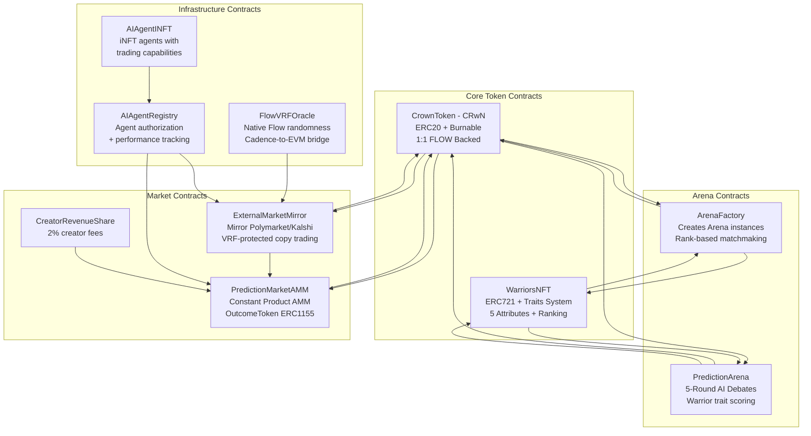

### Flow Cadence Contracts

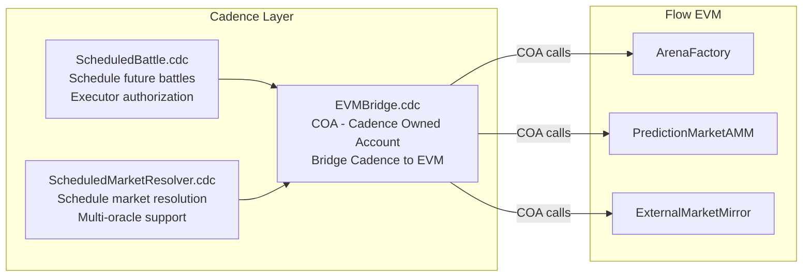

### Deployed Contract Addresses

| Contract | Address | Network | Purpose |
|----------|---------|---------|---------|
| CrownToken (CRwN) | `0x9Fd6CCEE1243EaC173490323Ed6B8b8E0c15e8e6` | Flow Testnet EVM | 1:1 FLOW-backed game currency |
| WarriorsNFT | `0x3838510eCa30EdeF7b264499F2B590ab4ED4afB1` | Flow Testnet EVM | Warrior character NFTs with traits |
| ArenaFactory | `0xf77840febD42325F83cB93F9deaE0F8b14Eececf` | Flow Testnet EVM | Arena creation and matchmaking |
| PredictionMarketAMM | `0x1b26203A2752557ecD4763a9A8A26119AC5e18e4` | Flow Testnet EVM | AMM-based prediction markets |
| FlowVRFOracle | `0xd81373eEd88FacE56c21CFA4787c80C325e0bC6E` | Flow Testnet EVM | Verifiable randomness |
| ExternalMarketMirror | `0x7485019de6Eca5665057bAe08229F9E660ADEfDa` | Flow Testnet EVM | Polymarket/Kalshi mirror markets |
| ScheduledBattle | `0xb4f445e1abc955a8` | Flow Testnet Cadence | Battle scheduling |
| ScheduledMarketResolver | `0xb4f445e1abc955a8` | Flow Testnet Cadence | Market resolution scheduling |
| EVMBridge | `0xb4f445e1abc955a8` | Flow Testnet Cadence | Cadence-to-EVM bridge via COA |

---

## Cron Job Automation Pipeline

Five Vercel cron jobs run automated operations across the platform.

| Cron Job | Schedule | Route | Purpose |
|----------|----------|-------|---------|
| Execute Battles | Every 1 minute | `/api/cron/execute-battles` | Execute ready scheduled battles |
| Execute Resolutions | Every 5 minutes | `/api/cron/execute-resolutions` | Resolve markets with oracle data |
| Settle Arbitrage | Every 5 minutes | `/api/cron/settle-arbitrage-battles` | Settle completed arbitrage trades |
| Detect Arbitrage | Every 10 minutes | `/api/cron/detect-arbitrage` | Find cross-market opportunities |
| Sync Markets | Every 6 hours | `/api/cron/sync-markets` | Sync Polymarket and Kalshi data |

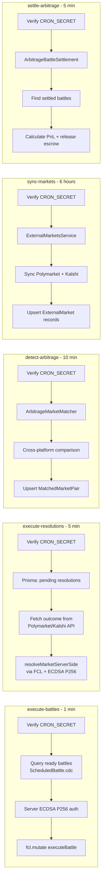

---

## Authentication Flows

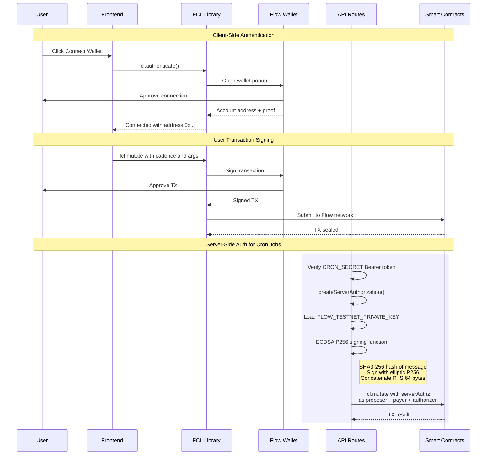

---

## Database Schema

Core entity relationships across the 40+ Prisma models:

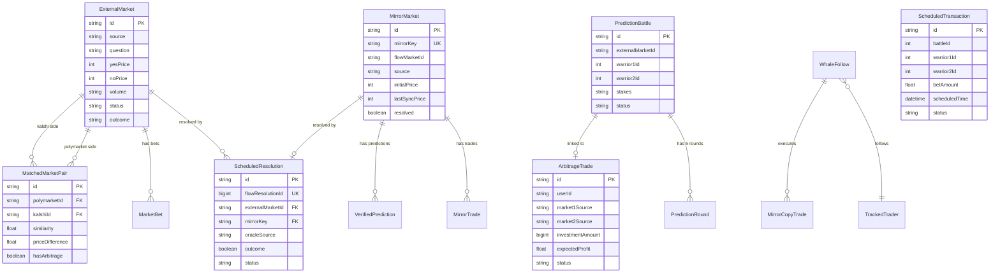

---

## Whale Tracking & Copy Trading Flow

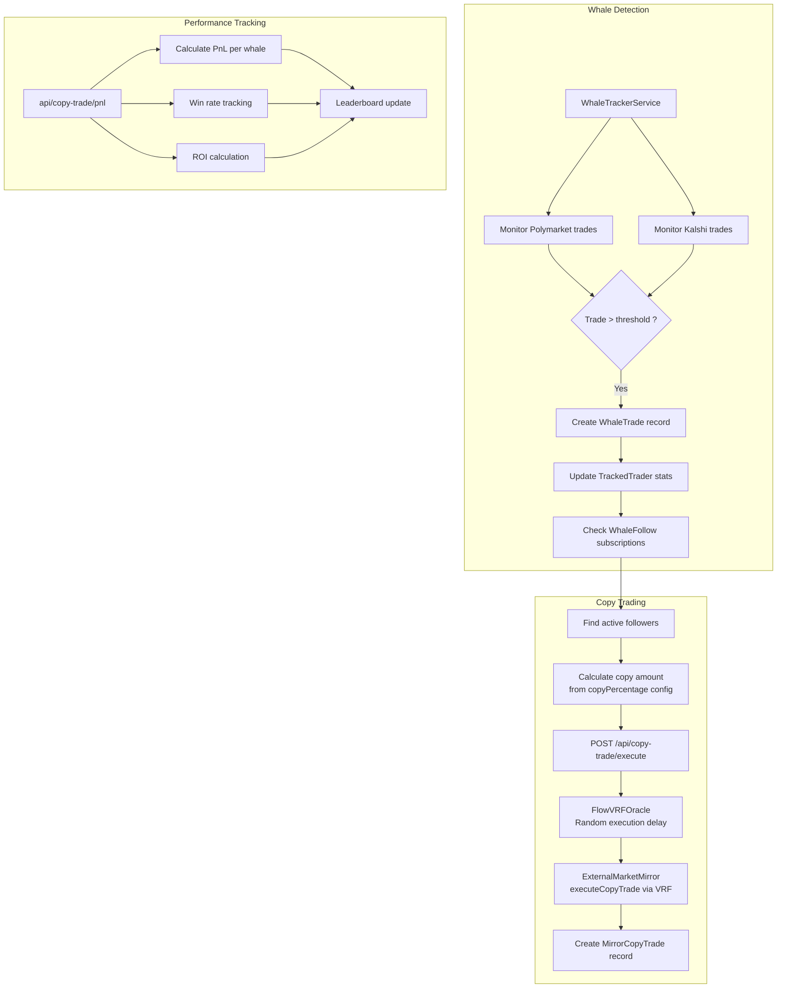

---

## 0G Network Integration

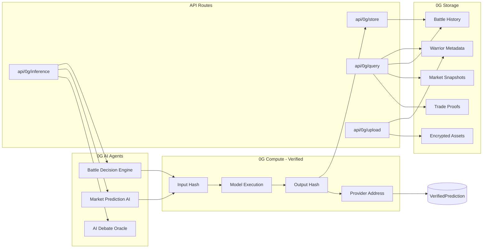

---

## API Architecture Overview

The platform exposes 90+ API routes organized by domain:

| Category | Route Pattern | Count | Key Operations |
|----------|--------------|-------|----------------|
| **Arena/Battles** | `/api/arena/*` | 10 | Create battles, execute, bet, leaderboard, warrior stats |
| **Markets** | `/api/markets/*` | 5 | Bet, settle, claim winnings, user-created markets |
| **External Markets** | `/api/external/*` | 7 | Polymarket, Kalshi, sync, arbitrage detection |
| **Flow/Cadence** | `/api/flow/*` | 5 | Scheduled TX, resolutions, VRF trades |
| **AI Agents** | `/api/agents/*` | 11 | Trading, copy trade, authorization, external trades |
| **Whale Tracking** | `/api/whale-alerts/*` | 10 | Alerts, follow/unfollow, stats, hot markets, history |
| **Arbitrage** | `/api/arbitrage/*` | 3 | Execute trades, trade history |
| **0G Network** | `/api/0g/*` | 11 | Store, query, inference, upload, deposit, balance |
| **Cron Jobs** | `/api/cron/*` | 5 | Execute battles, resolutions, sync, arbitrage |
| **AI/Debate** | `/api/ai/*` | 2 | AI debate creation and rounds |
| **Copy Trading** | `/api/copy-trade/*` | 3 | Execute, mirror history, P&L |
| **Contract** | `/api/contract/*` | 2 | Read, batch-read smart contracts |
| **Portfolio** | `/api/portfolio/*` | 2 | Native and mirror portfolio |
| **Other** | Various | 10+ | Health, metrics, oracle, admin, creator, game master |

---

## Project Directory Structure

```
WarriorsAI-rena/
├── src/                              # Solidity contracts (EVM)
│   ├── Arena.sol                     # Battle engine
│   ├── ArenaFactory.sol              # Arena creation
│   ├── CrownToken.sol                # CRwN token (1:1 FLOW)
│   ├── WarriorsNFT.sol               # Warrior NFTs with traits
│   ├── PredictionMarketAMM.sol       # AMM prediction markets
│   ├── ExternalMarketMirror.sol      # Polymarket/Kalshi mirror
│   ├── FlowVRFOracle.sol             # VRF randomness
│   ├── PredictionArena.sol           # AI debate arena
│   ├── AIAgentINFT.sol               # AI agent iNFTs
│   ├── AIAgentRegistry.sol           # Agent authorization
│   ├── CreatorRevenueShare.sol       # Creator fees
│   └── interfaces/                   # Contract interfaces
├── cadence/                          # Cadence smart contracts
│   ├── contracts/
│   │   ├── ScheduledBattle.cdc
│   │   ├── ScheduledMarketResolver.cdc
│   │   └── EVMBridge.cdc
│   ├── transactions/                 # Cadence transactions
│   └── scripts/                      # Cadence query scripts
├── frontend/                         # Next.js application
│   ├── src/
│   │   ├── app/
│   │   │   ├── api/                  # 90+ API route handlers
│   │   │   │   ├── arena/            # Battle routes
│   │   │   │   ├── markets/          # Market routes
│   │   │   │   ├── external/         # External market routes
│   │   │   │   ├── cron/             # 5 cron jobs
│   │   │   │   ├── flow/             # Cadence integration
│   │   │   │   ├── agents/           # AI agent routes
│   │   │   │   ├── whale-alerts/     # Whale tracking
│   │   │   │   ├── arbitrage/        # Arbitrage routes
│   │   │   │   └── 0g/              # 0G storage/compute
│   │   │   ├── prediction-arena/     # AI debate UI
│   │   │   ├── markets/              # Market UI
│   │   │   ├── whale-tracker/        # Whale tracker UI
│   │   │   └── leaderboard/          # Rankings
│   │   ├── components/               # React components
│   │   │   ├── flow/                 # Flow wallet UI
│   │   │   ├── arena/                # Battle components
│   │   │   ├── markets/              # Market components
│   │   │   └── ui/                   # Shared UI components
│   │   ├── hooks/                    # 58+ custom React hooks
│   │   ├── lib/                      # Utilities
│   │   │   ├── flow/                 # FCL client, serverAuth
│   │   │   ├── auth/                 # Auth utilities
│   │   │   └── monitoring/           # Battle monitoring
│   │   ├── services/                 # Business logic
│   │   │   ├── externalMarkets/      # Polymarket, Kalshi
│   │   │   └── arbitrage/            # Market matcher
│   │   ├── contexts/                 # React contexts
│   │   └── types/                    # TypeScript types
│   ├── prisma/
│   │   └── schema.prisma             # 40+ database models
│   └── vercel.json                   # Cron job configuration
├── arena-backend/                    # Express.js backend
│   └── src/
│       ├── index.ts                  # Express app
│       └── routes/                   # Backend routes
├── scripts/                          # Deployment scripts
│   ├── deploy-cadence.sh             # Deploy Cadence contracts
│   ├── deploy-production.sh          # Production deployment
│   └── deploy-vercel.sh              # Vercel deployment
├── flow.json                         # Cadence deployment config
└── foundry.toml                      # Foundry config (EVM)
```

---

## Getting Started

### Prerequisites

- Node.js 18+ and npm
- Git
- Foundry (for EVM smart contract development)
- Flow CLI (for Cadence contract deployment)
- Wallet with Flow Testnet tokens

### Installation

```bash
# Clone the repository
git clone https://github.com/your-username/WarriorsAI-rena.git
cd WarriorsAI-rena

# Install EVM contract dependencies
forge install

# Install frontend dependencies
cd frontend
npm install

# Install 0G storage service
cd 0g-storage
npm install && npm run build
cd ..

# Install arena backend
cd ../arena-backend
npm install
```

### Environment Configuration

Create `.env.local` in the `frontend/` directory:

```bash
# Flow Testnet (EVM)
FLOW_TESTNET_RPC=https://testnet.evm.nodes.onflow.org
NEXT_PUBLIC_GAME_MASTER_PRIVATE_KEY=your_private_key

# Flow Testnet (Cadence) - Server Auth
FLOW_TESTNET_ADDRESS=0xb4f445e1abc955a8
FLOW_TESTNET_PRIVATE_KEY=your_cadence_private_key
NEXT_PUBLIC_FLOW_TESTNET_ADDRESS=0xb4f445e1abc955a8
FLOW_RPC_URL=https://rest-testnet.onflow.org

# Cron Security
CRON_SECRET=your_cron_secret_min_32_chars

# 0G Network
PRIVATE_KEY=your_0g_private_key
NEXT_PUBLIC_0G_RPC=https://evmrpc-testnet.0g.ai/
NEXT_PUBLIC_0G_INDEXER=https://indexer-storage-testnet-standard.0g.ai

# Database
DATABASE_URL=file:./dev.db

# External Markets
POLYMARKET_API_KEY=your_polymarket_key
KALSHI_API_KEY=your_kalshi_key

# Pinata IPFS
PINATA_JWT=your_pinata_jwt
NEXT_PUBLIC_GATEWAY_URL=your_gateway_url

# Smart Contract Addresses
NEXT_PUBLIC_CRWN_TOKEN_ADDRESS=0x9Fd6CCEE1243EaC173490323Ed6B8b8E0c15e8e6
NEXT_PUBLIC_WARRIORS_NFT_ADDRESS=0x3838510eCa30EdeF7b264499F2B590ab4ED4afB1
NEXT_PUBLIC_ARENA_FACTORY_ADDRESS=0xf77840febD42325F83cB93F9deaE0F8b14Eececf

# App URL
NEXT_PUBLIC_APP_URL=http://localhost:3000
```

### Running the Project

```bash
# Terminal 1: Frontend + 0G storage (concurrent)
cd frontend
npm run dev

# Terminal 2: Arena backend
cd arena-backend
npm start

# Database migrations (first run)
cd frontend
npx prisma migrate dev
npx prisma studio  # Optional: web-based DB browser
```

The application will be available at `http://localhost:3000`.

### Smart Contract Development

```bash
# Compile EVM contracts
forge build

# Run EVM tests
forge test

# Deploy Cadence contracts to Flow testnet
./scripts/deploy-cadence.sh

# Verify Flow deployment
./scripts/verify-flow-deployment.sh
```

---

## Security Features

### Smart Contract Security
- **Reentrancy Guards**: Protection against reentrancy attacks on all state-changing functions
- **ECDSA Signature Verification**: All AI decisions cryptographically signed and verified on-chain
- **Time Locks**: Betting periods and battle intervals prevent manipulation
- **Oracle Verification**: VRF-based randomness from Flow's native Cadence randomness

### Economic Security
- **Defluence Limits**: One defluence per player per game prevents griefing
- **1:1 FLOW Backing**: CRwN token fully backed, preventing death spirals
- **Escrow Locks**: Arbitrage trades locked in escrow until settlement
- **Audit Logging**: All trades recorded in TradeAuditLog for transparency

### Authentication Security
- **Dual Auth Model**: Client-side FCL wallet + server-side ECDSA P256 for cron jobs
- **CRON_SECRET**: Bearer token validation on all automated endpoints
- **Private Key Isolation**: Server-side keys never exposed to client

---

## Game Economics

### Token Utility Flow

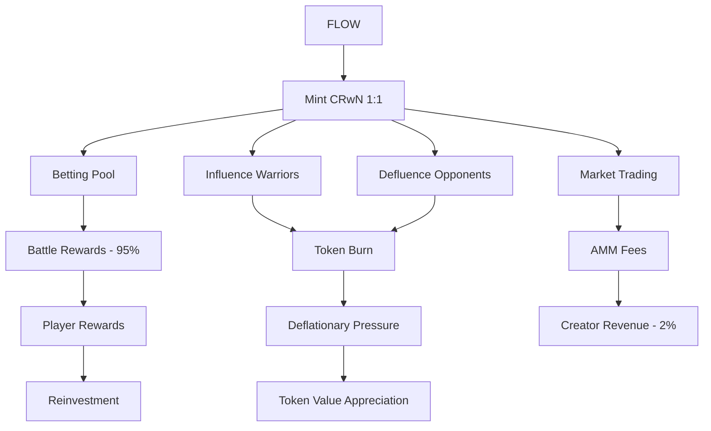

### Reward Distribution
- **Battle Winners**: 95% of betting pool
- **Protocol**: 5% for ecosystem development (future)
- **Market Creators**: 2% of market trading fees via CreatorRevenueShare
- **Warrior Owners**: Rank-based progression rewards

---

## License

This project is licensed under the MIT License - see the [LICENSE](LICENSE) file for details.

## Acknowledgments

- **Flow Blockchain** - EVM-compatible infrastructure and native Cadence runtime
- **0G Network** - Decentralized AI agents, verified compute, and storage
- **Polymarket & Kalshi** - External prediction market data feeds
- **Foundry** - Smart contract development framework
- **Next.js** - React meta-framework
- **OpenZeppelin** - Secure smart contract libraries

---

**Built by the Seeers Team at ETH Global Cannes**

*Where AI meets blockchain, and every battle tells a story.*
