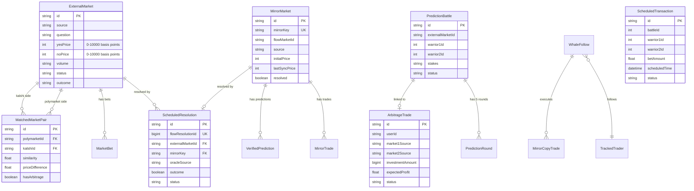

# WarriorsAI-rena: AI-Powered Blockchain Battle Arena

> **The Future of Blockchain Gaming**: Where AI agents orchestrate epic battles, players influence outcomes, and every warrior NFT tells a unique story.

## Project Overview

**WarriorsAI-rena** is a decentralized AI-powered battle arena that combines:
- **AI-Powered Combat**: Real AI agents make strategic decisions during 5-round battles
- **Prediction Markets**: On-chain AMM-based markets with YES/NO outcome tokens
- **External Market Integration**: Mirrors Polymarket & Kalshi markets onto Flow blockchain
- **Cross-Market Arbitrage**: Automated detection and execution of arbitrage opportunities
- **Whale Tracking & Copy Trading**: Monitor and mirror top trader positions
- **True Ownership**: Warriors as dynamic NFTs with evolving traits and rankings
- **Sustainable Economics**: Crown Token (CRwN) with 1:1 FLOW backing
- **Dual-Layer Blockchain**: Flow Cadence (scheduling/bridge) + Flow EVM (contracts/tokens)

### Technical Stack

| Component | Technology | Purpose |
|-----------|------------|---------|
| **Frontend** | Next.js 15 + React 19 + TypeScript | Modern app router web interface |
| **Blockchain (EVM)** | Solidity + Foundry on Flow Testnet | Battle logic, AMM, tokenomics |
| **Blockchain (Cadence)** | Cadence 1.0 on Flow Testnet | Scheduled transactions, market resolution, EVM bridge |
| **AI Layer** | 0G Network AI Agents | Battle decisions, market predictions, debate AI |
| **Storage** | 0G Decentralized Storage + Pinata IPFS | Encrypted metadata, battle history |
| **Backend** | Next.js API Routes (96 endpoints) | Serverless arena orchestration and automation |
| **Database** | Prisma ORM + SQLite (dev) / PostgreSQL (prod) | 41 models for markets, trades, arbitrage |
| **External Markets** | Polymarket + Kalshi APIs | External prediction market data feeds |
| **Infrastructure** | Rate limiting + consistent hashing + distributed cache | Serverless-optimized performance layer |
| **Wallet** | FCL + RainbowKit + wagmi | Flow + 0G wallet connection and signing |
| **Deployment** | Vercel + Vercel Cron | CI/CD with 6 automated cron jobs |

---

## Full System Architecture


---

## Infrastructure & Performance Layer

The platform includes a production-grade infrastructure layer optimized for Vercel serverless.

### Rate Limiting

All 96 API routes + 6 cron routes are protected with **100% named preset coverage**.


**Key files**: `lib/api/rateLimit.ts`, `lib/api/middleware.ts`

### Consistent Hashing & RPC Routing

FNV-1a hash ring distributes requests across weighted RPC nodes for deterministic routing and node-level caching.


- Same routing key always maps to same RPC node (cache-friendly)
- `createFlowPublicClientForKey(key)` / `executeWithFlowFallbackForKey(key, fn)` for hash-routed requests
- Shared `isTimeoutError()` exported from `flowClient.ts` (no inline copies)
- 0G chain defined once in `zeroGClient.ts` (zero inline `defineChain` calls)

**Key files**: `lib/hashing/consistentHash.ts`, `lib/flowClient.ts`, `lib/zeroGClient.ts`, `lib/apiConfig.ts`

### Distributed Caching

Hash-distributed LRU cache with 3 specialized instances.


Wired into 15+ routes: whale-alerts, hot-markets, top-whales, agents, arena/markets, metrics, health, arbitrage, leaderboard, portfolio.

**Key files**: `lib/cache/hashedCache.ts`, `lib/cache/index.ts`

### Composable Middleware

All routes use a composable middleware pipeline with automatic error handling.


**14 middleware functions**: `withRateLimit`, `withCronAuth`, `withInternalAuth`, `withCORS`, `withLogging`, `withValidation`, `withCache`, `withRequestId`, `withTimeout`, `onlyMethods`, `forMethods`, `createHandler`

**4 presets**: `presets.api(prefix, preset)`, `presets.publicApi(prefix, preset)`, `presets.cron(prefix)`, `presets.internal(prefix)`

**Key files**: `lib/api/middleware.ts`, `lib/api/errorHandler.ts`, `lib/api/cronAuth.ts`

---

## AI Battle System Flow

The battle system runs 5 rounds of AI-powered combat where warriors use traits (Strength, Wit, Charisma, Defence, Luck) to determine move effectiveness.


### Battle Moves

| Move | Primary Trait | Description |
|------|--------------|-------------|
| STRIKE | Strength | Direct power-based attack |
| TAUNT | Charisma + Wit | Social manipulation combo |
| DODGE | Defence | Evasion-focused defense |
| SPECIAL | Strength + Personality | Ultimate trait-based attack |
| RECOVER | Defence + Charisma | Healing and regrouping |

---

## Prediction Market & AMM Flow


---

## External Market Integration Pipeline

WarriorsAI-rena mirrors prediction markets from Polymarket and Kalshi onto Flow, enabling cross-platform trading and arbitrage.

### Polymarket Integration

- **API**: Gamma API (`gamma-api.polymarket.com`) for market discovery, CLOB API for trading
- **Price format**: Returns 0-1 decimal (e.g., `0.52`) -> normalized to 0-100
- **Quirk**: Returns JSON-encoded string arrays for `outcomes`, `outcomePrices`, `clobTokenIds`, `tags` — handled by `jsonStringArray` Zod preprocessor in `polymarketSchemas.ts`
- **Volume**: ~1000 active markets synced per cycle

### Kalshi Integration

- **Auth**: RSA-PSS per-request signing via `kalshiAuth.ts` (Node.js `crypto.sign()` with SHA-256, salt length 32)
- **API domain**: `api.elections.kalshi.com/trade-api/v2`
- **2-Phase market fetch** (avoids 10,000+ KXMVE* sports parlays):
  1. Fetch events via `/events?status=open`, filter to relevant categories (Politics, Economics, Climate, Science, etc.)
  2. Parallel fetch markets by `series_ticker` in **batches of 5** using `Promise.allSettled()`
- **Result**: ~500 non-sports markets from ~55 unique series in ~0.75s
- **Price format**: Returns 0-100 cents (bid/ask) -> midpoint -> normalized to 0-100


---

## Arbitrage Detection & Execution Flow

### Price Pipeline

```
Polymarket API (0-1 decimal)  -->  x100  -->  Unified (0-100)  -->  x100  -->  DB (0-10000 basis points)
Kalshi API (0-100 cents)      -->  mid   -->  Unified (0-100)  -->  x100  -->  DB (0-10000 basis points)

DB (0-10000)  -->  dbToUnified() /100  -->  Unified (0-100)  -->  /100  -->  calculateArbitrage (0-1 decimal)
```

### Detection & Execution


**Matching algorithm**: Jaccard similarity on cleaned word sets (lowercase, non-alphanumeric removed, 40+ stop words filtered, minimum word length > 1). Threshold: **0.35** (balances precision vs recall).

**Result**: ~557 arbitrage opportunities detected across Polymarket vs Kalshi (Fed chair, GDP, climate, elections, etc.)

---

## Smart Contract Architecture

### Flow EVM Contracts


### Flow Cadence Contracts


### Deployed Contract Addresses

| Contract | Address | Network | Purpose |
|----------|---------|---------|---------|
| CrownToken (CRwN) | `0x9Fd6CCEE1243EaC173490323Ed6B8b8E0c15e8e6` | Flow Testnet EVM | 1:1 FLOW-backed game currency |
| WarriorsNFT | `0x3838510eCa30EdeF7b264499F2B590ab4ED4afB1` | Flow Testnet EVM | Warrior character NFTs with traits |
| ArenaFactory | `0xf77840febD42325F83cB93F9deaE0F8b14Eececf` | Flow Testnet EVM | Arena creation and matchmaking |
| PredictionMarketAMM | `0x1b26203A2752557ecD4763a9A8A26119AC5e18e4` | Flow Testnet EVM | AMM-based prediction markets |
| FlowVRFOracle | `0xd81373eEd88FacE56c21CFA4787c80C325e0bC6E` | Flow Testnet EVM | Verifiable randomness |
| ExternalMarketMirror | `0x7485019de6Eca5665057bAe08229F9E660ADEfDa` | Flow Testnet EVM | Polymarket/Kalshi mirror markets |
| ScheduledBattle | `0xb4f445e1abc955a8` | Flow Testnet Cadence | Battle scheduling |
| ScheduledMarketResolver | `0xb4f445e1abc955a8` | Flow Testnet Cadence | Market resolution scheduling |
| EVMBridge | `0xb4f445e1abc955a8` | Flow Testnet Cadence | Cadence-to-EVM bridge via COA |

---

## Cron Job Automation Pipeline

Six Vercel cron jobs run automated operations across the platform.

| Cron Job | Schedule | Route | Purpose |
|----------|----------|-------|---------|
| Execute Battles | Daily at 00:00 UTC | `/api/cron/execute-battles` | Execute ready scheduled battles |
| Execute Resolutions | Daily at 04:00 UTC | `/api/cron/execute-resolutions` | Resolve markets with oracle data |
| Sync Markets | Daily at 06:00 UTC | `/api/cron/sync-markets` | Sync Polymarket and Kalshi data |
| Detect Arbitrage | Daily at 06:30 UTC | `/api/cron/detect-arbitrage` | Find cross-market opportunities |
| Settle Arbitrage | Daily at 12:00 UTC | `/api/cron/settle-arbitrage-battles` | Settle completed arbitrage trades |
| Sync Whale Trades | Daily at 18:00 UTC | `/api/cron/sync-whale-trades` | Sync whale trade data from platforms |


All cron routes use `withCronAuth` middleware requiring `CRON_SECRET` Bearer token (minimum 32 characters). Configurable timeouts via `withCronTimeout()` (default 240s).

---

## Authentication Flows


---

## Database Schema

Core entity relationships across the 41 Prisma models:



---

## Whale Tracking & Copy Trading Flow


---

## 0G Network Integration


---

## API Architecture Overview

The platform exposes 96 API routes organized by domain:

| Category | Route Pattern | Count | Key Operations |
|----------|--------------|-------|----------------|
| **Arena/Battles** | `/api/arena/*` | 11 | Create battles, execute, bet, leaderboard, warrior stats, matched markets, arbitrage opportunities |
| **AI Agents** | `/api/agents/*` | 13 | Trading, authorization, external trades, copy trade, auto-predict, transfer, decrypt |
| **0G Network** | `/api/0g/*` | 11 | Store, query, inference, upload, deposit, balance, health, market-context, reencrypt |
| **Whale Tracking** | `/api/whale-alerts/*` | 10 | Alerts, follow/unfollow, stats, hot markets, top whales, history, traders |
| **External Markets** | `/api/external/*` | 6 | Polymarket, Kalshi, sync, sync-history, arbitrage detection |
| **Markets** | `/api/markets/*` | 6 | Bet, settle, claim winnings, user-created markets, bet history |
| **Cron Jobs** | `/api/cron/*` | 6 | Execute battles, resolutions, sync markets, detect arbitrage, settle, sync whales |
| **Flow/Cadence** | `/api/flow/*` | 5 | Scheduled TX, resolutions, VRF trades, agent positions |
| **Arbitrage** | `/api/arbitrage/*` | 4 | Execute trades, trade history, trade details |
| **Copy Trading** | `/api/copy-trade/*` | 3 | Execute, mirror history, P&L |
| **AI/Debate** | `/api/ai/*` | 2 | AI debate creation and rounds |
| **Contract** | `/api/contract/*` | 2 | Read, batch-read smart contracts |
| **Portfolio** | `/api/portfolio/*` | 2 | Native and mirror portfolio |
| **Events** | `/api/events/*` | 3 | Start, stop, status for event listeners |
| **Other** | Various | 12 | Health, metrics, RPC health, oracle, admin, creator, game master, file upload, battle generation |

---

## Project Directory Structure

```
WarriorsAI-rena/
├── src/                              # Solidity contracts (EVM)
│   ├── Arena.sol                     # Battle engine
│   ├── ArenaFactory.sol              # Arena creation
│   ├── CrownToken.sol                # CRwN token (1:1 FLOW)
│   ├── WarriorsNFT.sol               # Warrior NFTs with traits
│   ├── PredictionMarketAMM.sol       # AMM prediction markets
│   ├── ExternalMarketMirror.sol      # Polymarket/Kalshi mirror
│   ├── FlowVRFOracle.sol             # VRF randomness
│   ├── PredictionArena.sol           # AI debate arena
│   ├── AIAgentINFT.sol               # AI agent iNFTs
│   ├── AIAgentRegistry.sol           # Agent authorization
│   ├── CreatorRevenueShare.sol       # Creator fees
│   └── interfaces/                   # Contract interfaces
├── cadence/                          # Cadence smart contracts
│   ├── contracts/
│   │   ├── ScheduledBattle.cdc
│   │   ├── ScheduledMarketResolver.cdc
│   │   └── EVMBridge.cdc
│   ├── transactions/                 # Cadence transactions
│   └── scripts/                      # Cadence query scripts
├── frontend/                         # Next.js application
│   ├── src/
│   │   ├── app/
│   │   │   ├── api/                  # 96 API route handlers
│   │   │   │   ├── arena/            # Battle routes (11)
│   │   │   │   ├── markets/          # Market routes (6)
│   │   │   │   ├── external/         # External market routes (6)
│   │   │   │   ├── cron/             # 6 cron jobs
│   │   │   │   ├── flow/             # Cadence integration (5)
│   │   │   │   ├── agents/           # AI agent routes (13)
│   │   │   │   ├── whale-alerts/     # Whale tracking (10)
│   │   │   │   ├── arbitrage/        # Arbitrage routes (4)
│   │   │   │   ├── 0g/              # 0G storage/compute (11)
│   │   │   │   └── ...              # ai, copy-trade, portfolio, etc.
│   │   │   ├── prediction-arena/     # AI debate UI
│   │   │   ├── markets/              # Market UI
│   │   │   ├── whale-tracker/        # Whale tracker UI
│   │   │   └── leaderboard/          # Rankings
│   │   ├── components/               # 80+ React components
│   │   │   ├── 0g/                   # 0G network components
│   │   │   ├── agents/               # Agent management
│   │   │   ├── ai/                   # AI debate UI
│   │   │   ├── arbitrage/            # Arbitrage opportunities
│   │   │   ├── arena/                # Battle arena
│   │   │   ├── creator/              # Creator economy
│   │   │   ├── debate/               # Debate system
│   │   │   ├── flow/                 # Flow wallet UI
│   │   │   ├── gamification/         # Gamification overlays
│   │   │   ├── markets/              # Market components
│   │   │   ├── micro-markets/        # Micro markets
│   │   │   ├── portfolio/            # Portfolio views
│   │   │   ├── whale/                # Whale tracking
│   │   │   └── ui/                   # Shared UI primitives
│   │   ├── hooks/                    # 75+ custom React hooks
│   │   ├── lib/                      # Infrastructure & utilities
│   │   │   ├── api/                  # Rate limiting, middleware, error handling, cron auth
│   │   │   ├── cache/                # LRU cache, hashed cache (3 instances)
│   │   │   ├── hashing/              # FNV-1a consistent hash ring
│   │   │   ├── queue/                # Request queues, battle execution queue
│   │   │   ├── flow/                 # FCL client, serverAuth
│   │   │   ├── auth/                 # Auth utilities, Kalshi RSA-PSS
│   │   │   ├── monitoring/           # Battle monitoring, alerts
│   │   │   ├── eventListeners/       # Scheduled resolution + market events
│   │   │   ├── flowClient.ts         # Shared Flow RPC with hash-ring routing
│   │   │   ├── zeroGClient.ts        # Centralized 0G chain + client factories
│   │   │   ├── apiConfig.ts          # RPC nodes, contract addresses, hash ring init
│   │   │   └── ...                   # prisma, logger, metrics, analytics
│   │   ├── services/                 # Business logic (55+ services)
│   │   │   ├── externalMarkets/      # Polymarket, Kalshi, whale tracking
│   │   │   │   └── schemas/          # Zod validation schemas
│   │   │   ├── arbitrage/            # Market matcher
│   │   │   ├── arena/                # Arena services
│   │   │   ├── betting/              # Market betting, order execution
│   │   │   ├── escrow/               # Escrow service
│   │   │   └── config/               # Trading config
│   │   ├── contexts/                 # React contexts
│   │   └── types/                    # TypeScript types
│   ├── prisma/
│   │   └── schema.prisma             # 41 database models
│   └── vercel.json                   # 6 cron jobs + Vercel config
├── arena-backend/                    # Express.js backend (legacy)
│   └── src/
│       ├── index.ts                  # Express app
│       └── routes/                   # Backend routes
├── scripts/                          # Deployment scripts
│   ├── deploy-cadence.sh             # Deploy Cadence contracts
│   ├── deploy-production.sh          # Production deployment
│   └── deploy-vercel.sh              # Vercel deployment
├── flow.json                         # Cadence deployment config
└── foundry.toml                      # Foundry config (EVM)
```

---

## Getting Started

### Prerequisites

- Node.js 18+ and npm
- Git
- Foundry (for EVM smart contract development)
- Flow CLI (for Cadence contract deployment)
- Wallet with Flow Testnet tokens

### Installation

```bash
# Clone the repository
git clone https://github.com/your-username/WarriorsAI-rena.git
cd WarriorsAI-rena

# Install EVM contract dependencies
forge install

# Install frontend dependencies
cd frontend
npm install

# Install 0G storage service
cd 0g-storage
npm install && npm run build
cd ..

# Install arena backend
cd ../arena-backend
npm install
```

### Environment Configuration

Create `.env.local` in the `frontend/` directory:

```bash
# Flow Testnet (EVM)
FLOW_TESTNET_RPC=https://testnet.evm.nodes.onflow.org
NEXT_PUBLIC_GAME_MASTER_PRIVATE_KEY=your_private_key

# Flow Testnet (Cadence) - Server Auth
FLOW_TESTNET_ADDRESS=0xb4f445e1abc955a8
FLOW_TESTNET_PRIVATE_KEY=your_cadence_private_key
NEXT_PUBLIC_FLOW_TESTNET_ADDRESS=0xb4f445e1abc955a8
FLOW_RPC_URL=https://rest-testnet.onflow.org

# Cron Security
CRON_SECRET=your_cron_secret_min_32_chars

# 0G Network
PRIVATE_KEY=your_0g_private_key
NEXT_PUBLIC_0G_RPC=https://evmrpc-testnet.0g.ai/
NEXT_PUBLIC_0G_INDEXER=https://indexer-storage-testnet-standard.0g.ai

# Database
DATABASE_URL=file:./dev.db

# External Markets
POLYMARKET_API_KEY=your_polymarket_key
KALSHI_API_KEY=your_kalshi_key

# Pinata IPFS
PINATA_JWT=your_pinata_jwt
NEXT_PUBLIC_GATEWAY_URL=your_gateway_url

# Smart Contract Addresses
NEXT_PUBLIC_CRWN_TOKEN_ADDRESS=0x9Fd6CCEE1243EaC173490323Ed6B8b8E0c15e8e6
NEXT_PUBLIC_WARRIORS_NFT_ADDRESS=0x3838510eCa30EdeF7b264499F2B590ab4ED4afB1
NEXT_PUBLIC_ARENA_FACTORY_ADDRESS=0xf77840febD42325F83cB93F9deaE0F8b14Eececf

# App URL
NEXT_PUBLIC_APP_URL=http://localhost:3000
```

### Running the Project

```bash
# Terminal 1: Frontend + 0G storage (concurrent)
cd frontend
npm run dev

# Terminal 2: Arena backend
cd arena-backend
npm start

# Database migrations (first run)
cd frontend
npx prisma migrate dev
npx prisma studio  # Optional: web-based DB browser
```

The application will be available at `http://localhost:3000`.

### Smart Contract Development

```bash
# Compile EVM contracts
forge build

# Run EVM tests
forge test

# Deploy Cadence contracts to Flow testnet
./scripts/deploy-cadence.sh

# Verify Flow deployment
./scripts/verify-flow-deployment.sh
```

---

## Security Features

### Smart Contract Security
- **Reentrancy Guards**: Protection against reentrancy attacks on all state-changing functions
- **ECDSA Signature Verification**: All AI decisions cryptographically signed and verified on-chain
- **Time Locks**: Betting periods and battle intervals prevent manipulation
- **Oracle Verification**: VRF-based randomness from Flow's native Cadence randomness

### Infrastructure Security
- **100% Rate Limiting**: All 96 API routes + 6 cron routes protected with named presets
- **Composable Middleware**: Automatic error handling prevents information leakage in production
- **Cron Authentication**: Bearer token validation (min 32 chars) on all automated endpoints
- **Circuit Breakers**: Trading circuit breaker prevents cascade failures

### Economic Security
- **Defluence Limits**: One defluence per player per game prevents griefing
- **1:1 FLOW Backing**: CRwN token fully backed, preventing death spirals
- **Escrow Locks**: Arbitrage trades locked in escrow until settlement
- **Audit Logging**: All trades recorded in TradeAuditLog for transparency

### Authentication Security
- **Dual Auth Model**: Client-side FCL wallet + server-side ECDSA P256 for cron jobs
- **Kalshi RSA-PSS**: Per-request cryptographic signing for Kalshi API access
- **Private Key Isolation**: Server-side keys never exposed to client

---

## Game Economics

### Token Utility Flow


### Reward Distribution
- **Battle Winners**: 95% of betting pool
- **Protocol**: 5% for ecosystem development (future)
- **Market Creators**: 2% of market trading fees via CreatorRevenueShare
- **Warrior Owners**: Rank-based progression rewards

---

## License

This project is licensed under the MIT License - see the [LICENSE](LICENSE) file for details.

## Acknowledgments

- **Flow Blockchain** - EVM-compatible infrastructure and native Cadence runtime
- **0G Network** - Decentralized AI agents, verified compute, and storage
- **Polymarket & Kalshi** - External prediction market data feeds
- **Foundry** - Smart contract development framework
- **Next.js** - React meta-framework
- **OpenZeppelin** - Secure smart contract libraries

---

**Built by the Seeers Team at ETH Global Cannes**

*Where AI meets blockchain, and every battle tells a story.*
